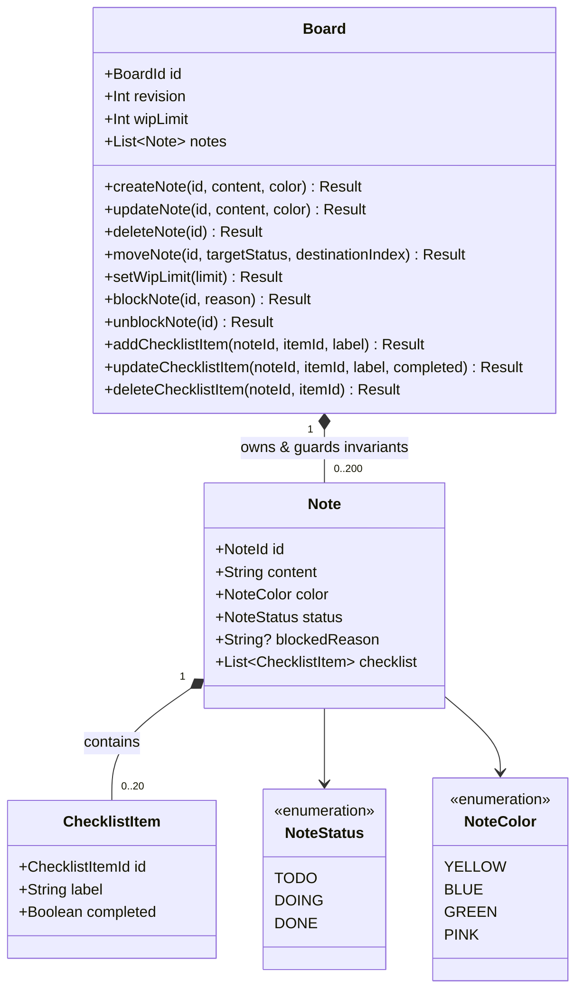
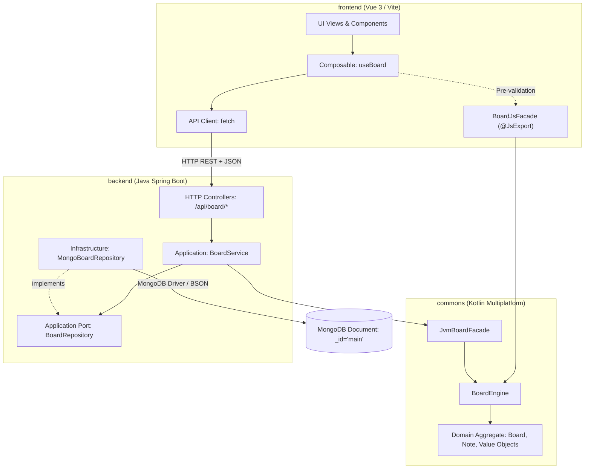

<!-- SPDX-License-Identifier: MIT -->
<!-- SPDX-FileCopyrightText: 2026 Lorenzo Tosi -->

# System Architecture & Domain Boundaries

This document defines the architectural structure, module layers, and Domain-Driven Design patterns implemented across Kotlin Multiplatform, Spring Boot, and Vue 3.

---

## 1. Domain Aggregate Model

The Kanban workflow is encapsulated inside a single Bounded Context. `Board` serves as the sole **Aggregate Root**, maintaining direct ownership and operational integrity over `Note` entities and nested `ChecklistItem` value entities.

### Invariant Enforcement Rules
- No Direct Sub-Entity Mutation: External layers cannot mutate `Note` or `ChecklistItem` properties directly. Every state modification passes through `Board` aggregate methods.

- Consistency Boundary: Invariants spanning multiple cards (such as ensuring the number of `DOING` notes does not exceed `wipLimit`) are evaluated synchronously within `Board`.

## 2. Layered Architecture & Module Dependencies
The codebase applies Clean/Hexagonal Architecture dependency rules. The domain core remains completely independent of frameworks, web libraries, and databases.

### Strict Dependency Constraints
- `commons`: Depends only on the Kotlin standard library and `kotlinx.serialization`. It contains no imports or annotations from Spring, MongoDB, Jackson, or Vue.
- `backend`: References `commons` via `JvmBoardFacade`. The domain is isolated from persistence documents; `BoardRepository` bridges application commands to MongoDB.
- `frontend`: Interacts with the backend via REST endpoints and optionally invokes `BoardJsFacade` for client-side pre-validation previews before network dispatch.

## 3. Concurrency Boundary & Conflict Prevention
Concurreny is managed via Optimistic Concurrency Control anchored to the `Board` aggregate:
- The persistent MongoDB document (`_id: "main"`) contains the current `revision` counter.
- Command executions read the board snapshot at revision $R$, evaluate business invariants in memory, and commit via an atomic compare and swap update:$$\text{Filter: } \{\_id: \text{"main"}, revision: R\} \implies \text{Set: } \{\text{snapshot}, revision: R + 1\}$$
- If another request advanced the revision in the interim, the filter returns zero matched documents (`matchedCount == 0`), throwing a `409 REVISION_CONFLICT` without partial writes or lost updates.
