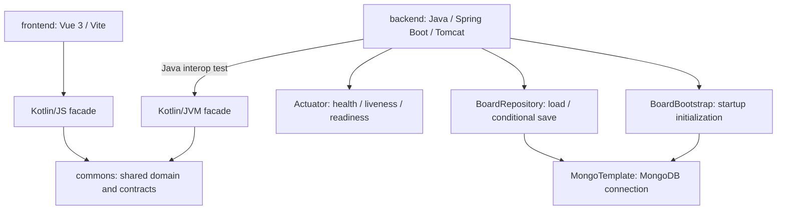
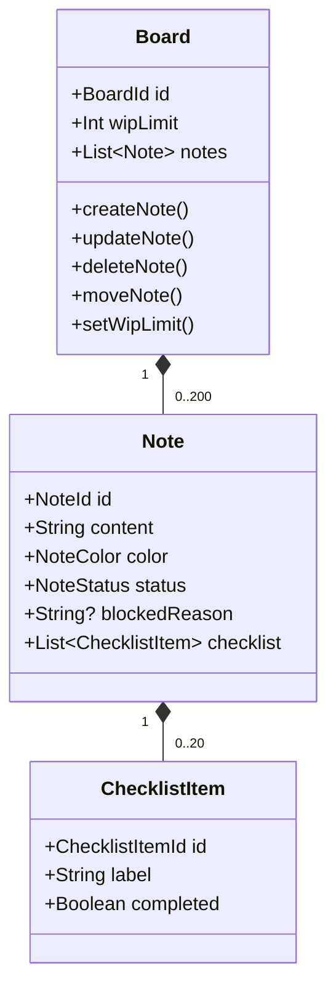
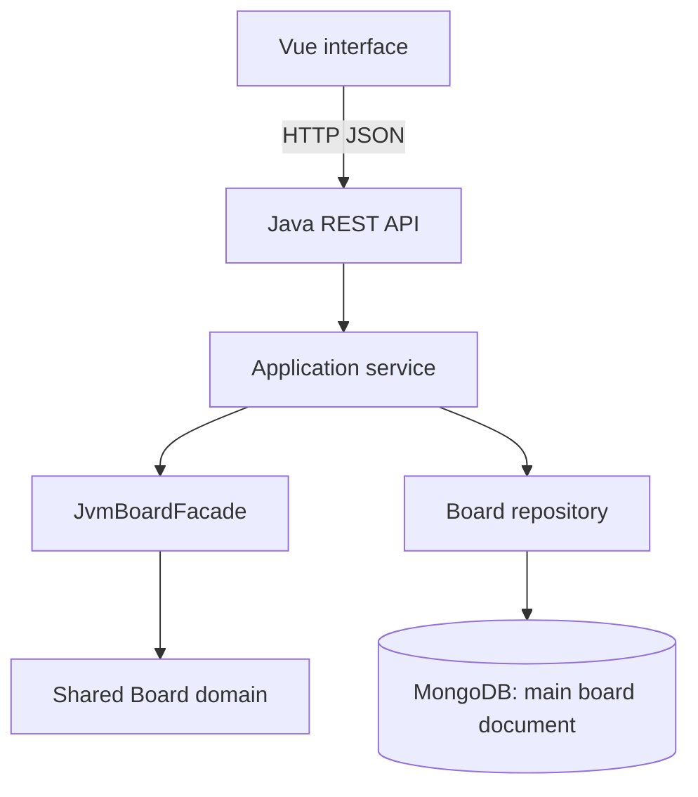

<!-- SPDX-License-Identifier: MIT -->
<!-- SPDX-FileCopyrightText: 2026 Lorenzo Tosi, Alessandro Stefani -->

# System Architecture and Domain Boundaries

This document separates the architecture implemented today from the planned runtime architecture.

## 1. Current architecture

The implemented system consists of three Gradle modules:

```mermaid
graph TD
    Frontend["frontend: Vue 3 / Vite"] --> JsFacade["Kotlin/JS facade"]
    Backend["backend: Java / Spring Boot / Tomcat"] -->|Java interop test| JvmFacade["Kotlin/JVM facade"]
    JsFacade --> Domain["commons: shared domain and contracts"]
    JvmFacade --> Domain
    Backend --> Health["Actuator: health / liveness / readiness"]
    Backend --> Repository["BoardRepository: load / conditional save"]
    Repository --> MongoClient["MongoTemplate: MongoDB connection"]
    Backend --> Bootstrap["BoardBootstrap: startup initialization"]
    Bootstrap --> MongoClient
```

- `commons` contains the Kotlin Multiplatform domain, commands, snapshots, serialization, and JVM/JavaScript facades.
- `frontend` contains a minimal Vue interface. `App.vue` imports the generated Kotlin/JS package and submits `CREATE_NOTE` commands through `evaluateBoardCommand`. It renders the returned board on success and preserves the draft and board on rejection. Notes remain in browser memory and are lost on reload; no backend request is made.
- `backend` is a Java/Spring Boot application using Spring Web MVC and embedded Tomcat. Actuator exposes health endpoints; `MainTest` starts the server and verifies HTTP liveness without a reachable database. `DomainInteropTest` verifies Java consumption of the JVM facade.
- Spring Data MongoDB configures a client from an environment-backed connection URI. The `local` and `test` profiles define local binding and test defaults; see [local development](development.md#backend-runtime).
- `MongoBoardRepository` loads and conditionally replaces the complete board in the `boards` collection. `BoardDocument` separates the persisted representation from Kotlin snapshots; `BoardDocumentMapper` validates snapshots through the shared domain before loading or saving. Missing boards produce an empty load result, while invalid persisted state and database failures propagate to the caller. See [persistence unit tests](testing.md#backend-persistence-unit-tests).
- `BoardServiceImpl.createNote` loads the board, checks the caller's expected revision, generates a UUID, executes the shared JVM command, and conditionally saves the resulting snapshot. Domain rejections raise `BoardServiceException` with the original code and optional field without saving. The service is exercised by [unit tests](testing.md#backend-application-service-unit-tests); REST integration remains part of R2. Missing boards, revision mismatches, and unmatched saves currently raise generic runtime exceptions.
- `BoardBootstrap` is a Spring Boot `ApplicationRunner`. On startup, it attempts an acknowledged upsert filtered only by `_id="main"`, with `$setOnInsert` for schema version `1`, revision `0`, WIP limit `3`, and an empty notes list. Existing documents are unchanged, including their revision and any invalid state; validation occurs when the repository loads them. A duplicate key from concurrent initialization is tolerated without a reset or retry. A MongoDB resource failure produces a warning and allows startup; initialization must be retried by restarting the backend after recovery. Other database errors and unacknowledged writes fail initialization.

`GET /actuator/health/liveness` reports application liveness independently of MongoDB. The aggregate `GET /actuator/health` includes MongoDB connectivity; the current readiness probe reports application state without a database check.

## 2. Implemented domain aggregate

The Kanban workflow is encapsulated inside one bounded context. `Board` is the sole aggregate root and owns `Note` entities and their `ChecklistItem` values.

```mermaid
classDiagram
    class Board {
        +BoardId id
        +Int wipLimit
        +List~Note~ notes
        +createNote()
        +updateNote()
        +deleteNote()
        +moveNote()
        +setWipLimit()
    }
    class Note {
        +NoteId id
        +String content
        +NoteColor color
        +NoteStatus status
        +String? blockedReason
        +List~ChecklistItem~ checklist
    }
    class ChecklistItem {
        +ChecklistItemId id
        +String label
        +Boolean completed
    }
    Board "1" *-- "0..200" Note
    Note "1" *-- "0..20" ChecklistItem
```

All state changes pass through the aggregate. This keeps WIP limits, ordering, blockers, checklist completion, capacities, and transition rules consistent across JVM and browser runtimes. A note's canonical position is its index inside the board's ordered collection, not an independent coordinate.

## 3. Target runtime architecture (R2)

R2 connects the existing shared domain and persistence adapter through REST controllers and an application service:

```mermaid
graph TD
    Vue["Vue interface"] -->|HTTP JSON| Controller["Java REST API"]
    Controller --> Service["Application service"]
    Service --> JvmFacade["JvmBoardFacade"]
    JvmFacade --> Domain["Shared Board domain"]
    Service --> Repository["Board repository"]
    Repository --> Mongo[("MongoDB: main board document")]
```

The intended dependency direction remains inward: framework and persistence code may depend on the shared domain, while `commons` must not depend on web, database, or UI frameworks.

## 4. Concurrency boundary

`MongoBoardRepository.save(updated, expectedRevision)` requires the snapshot revision to match the non-negative expected revision. It checks for integer overflow, validates the candidate state, and performs one replacement filtered by `_id="main"` and `revision=expectedRevision`. The replacement stores revision `expectedRevision + 1` and uses no upsert. The repository requires an acknowledged write, returns the saved snapshot on a match, and returns an empty result on no match without retrying. This provides a single-document compare-and-swap boundary without multi-document transactions.

Within R2, the application service and REST endpoints must connect this boundary to each mutating request's expected revision and return `409 REVISION_CONFLICT` when the stored revision does not match.

The accepted rationale and trade-offs are recorded in [ADR 001](adr/001-board-aggregate.md) and [ADR 002](adr/002-local-scope.md).
