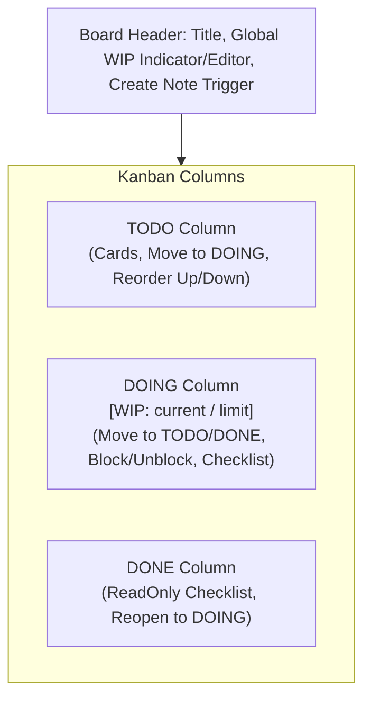
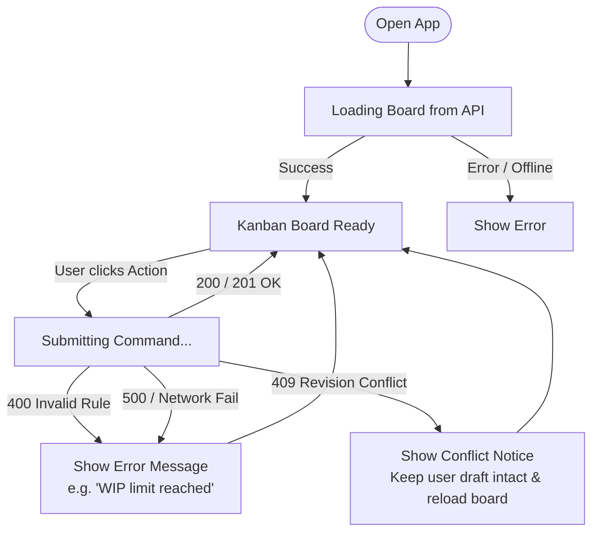

<!-- SPDX-License-Identifier: MIT -->
<!-- SPDX-FileCopyrightText: 2026 Lorenzo Tosi, Alessandro Stefani -->

# User Experience & Interface States Specification

This document details the layout, user interactions, accessibility constraints, and state transitions for the Sticky Notes Kanban board.

---

## 1. Board Layout & Visual Hierarchy

The interface presents a responsive 3-column layout (`TODO`, `DOING`, `DONE`). On desktop screens, columns are side-by-side; on mobile viewports (<640px), columns stack vertically with smooth scrolling and accessible touch targets.



## 2. Note Card Component Layout

```plaintext
+-------------------------------------------------------------+
| [Color Badge: GREEN]                         [Delete Button]|
|                                                             |
| Note text content displayed with preserved whitespace...    |
| (1..500 UTF-16 code units)                                  |
|                                                             |
| [Blocker Alert: "Waiting for API specs"] (if blocked)       |
|                                                             |
| Checklist Progress: [ 2 / 3 completed ]                     |
| > [x] Task 1                                                |
| > [ ] Task 2                                                |
| > [x] Task 3                                                |
|                                                             |
| [Up] [Down] | [Move to DOING / Move to DONE / Reopen]       |
| [Edit Note] | [Manage Checklist] | [Block/Unblock]          |
+-------------------------------------------------------------+
```
## 3. Interaction States & Transitions

### 3.1 Allowed In-Card Actions by Column State

| Action | `TODO`                                       | `DOING` | `DONE`                                 |
| :--- |:---------------------------------------------| :--- |:---------------------------------------|
| **Edit Text / Color** | Allowed                                      | Allowed | Allowed                                |
| **Reorder Up / Down** | Allowed                                      | Allowed | Allowed                                |
| **Move to DOING** | Allowed (if unblocked and DOING < WIP Limit) | N/A | Allowed (Reopen, if DOING < WIP Limit) |
| **Move to TODO** | N/A                                          | Allowed (if unblocked) | Rejected (`INVALID_TRANSITION`)        |
| **Move to DONE** | Rejected (`INVALID_TRANSITION`)              | Allowed (if unblocked & checklist full) | N/A                                    |
| **Block / Unblock** | Allowed                                      | Allowed | Rejected (`NOTE_DONE_READ_ONLY`)       |
| **Edit Checklist** | Allowed                                      | Allowed | Read-Only                              |
| **Delete Note** | Allowed (with confirmation)                  | Allowed (with confirmation) | Allowed (with confirmation)            |

### 3.2 State Lifecycle & Edge Cases


## 4. Concurrency & Conflict Handling

When an operation fails with `409 REVISION_CONFLICT`:

* **Never mutate optimistically**: The UI never assumes state mutation before receiving server confirmation.
* **Preserve Draft**: In-memory input (e.g., edited note text or newly typed checklist item) is preserved in a local draft buffer.
* **Banner Notification**: An `aria-live="assertive"` banner informs the user: *"The board was updated in another window. Your changes have been preserved. Please review the updated board and click Submit again."*
* **Resubmit Protocol**: Automatic retries are strictly forbidden. The user must manually confirm resubmission against the freshly reloaded `currentRevision`.

---

## 5. Accessibility & Responsive Behavior

### 5.1 Keyboard Navigation and Focus Management

* **No Drag-and-Drop Requirement**: All movements are executed via accessible `<button>` elements (e.g., "Move to Doing", "Move Up", "Move Down").
* **Focus Restoration**:
    * Closing an editor restores focus to the invoking card's "Edit" button.
    * Deleting a note restores focus to the nearest sibling note or the "Add Note" button if the column becomes empty.
* **Form Controls**: Labels and input fields are explicitly associated via `id` and `for` attributes.

### 5.2 Visual & Sensory Cues

* **Color Representation**: Visual sticky note colors (`YELLOW`, `BLUE`, `GREEN`, `PINK`) are accompanied by explicit text badges (e.g., `[Yellow]`, `[Blue]`) and meet WCAG AA contrast standards.
* **Blocked State**: A blocked note features an alert banner with the textual reason, avoiding reliance on icons alone.

### 5.3 Responsive Adaptability

* **Desktop**: 3 side-by-side flex/grid columns.
* **Mobile / Narrow Viewport (down to 360px)**: Columns stack vertically or scroll horizontally with prominent section headers. No interactive control is truncated or clipped outside the viewport.
